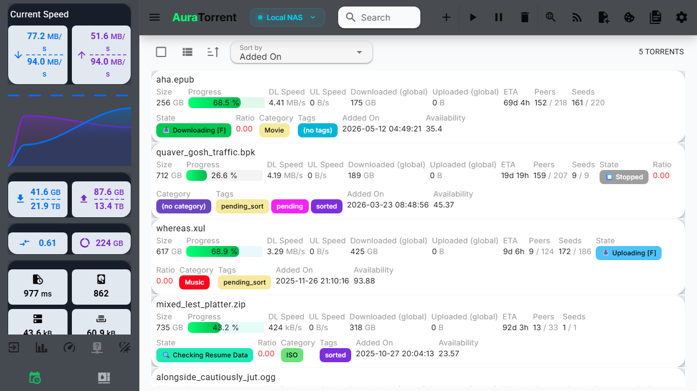
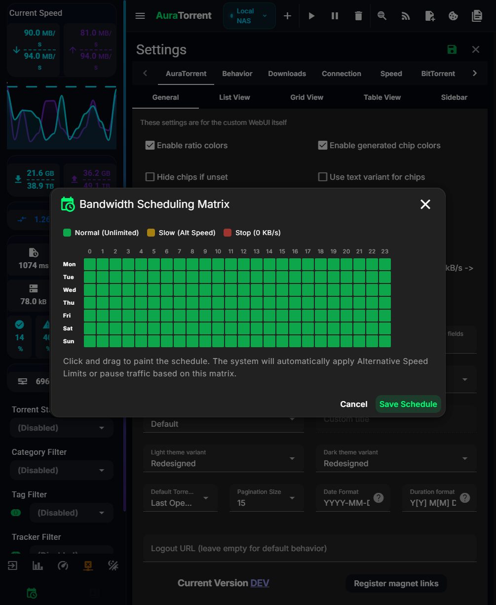
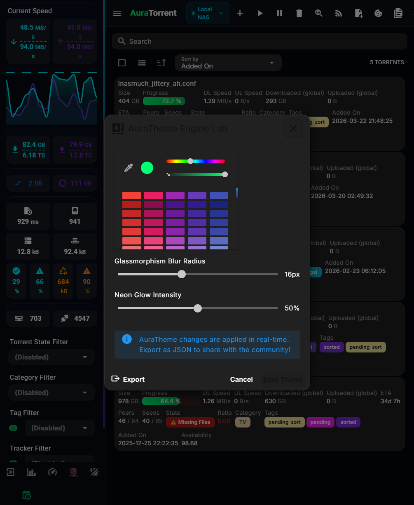
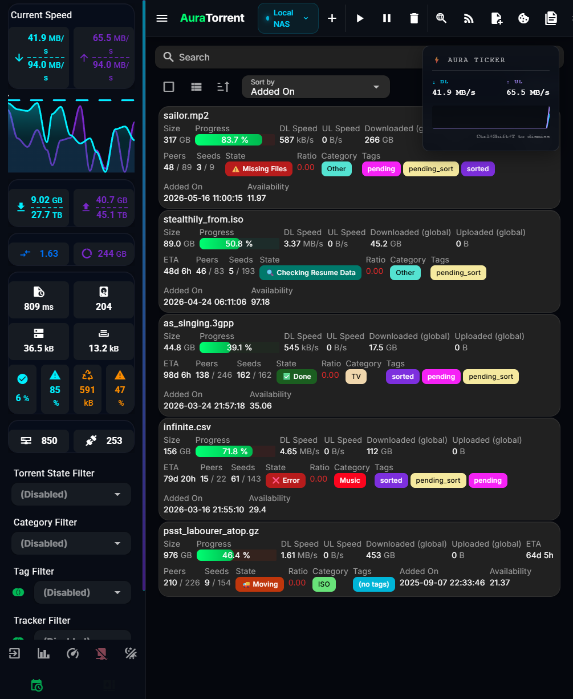
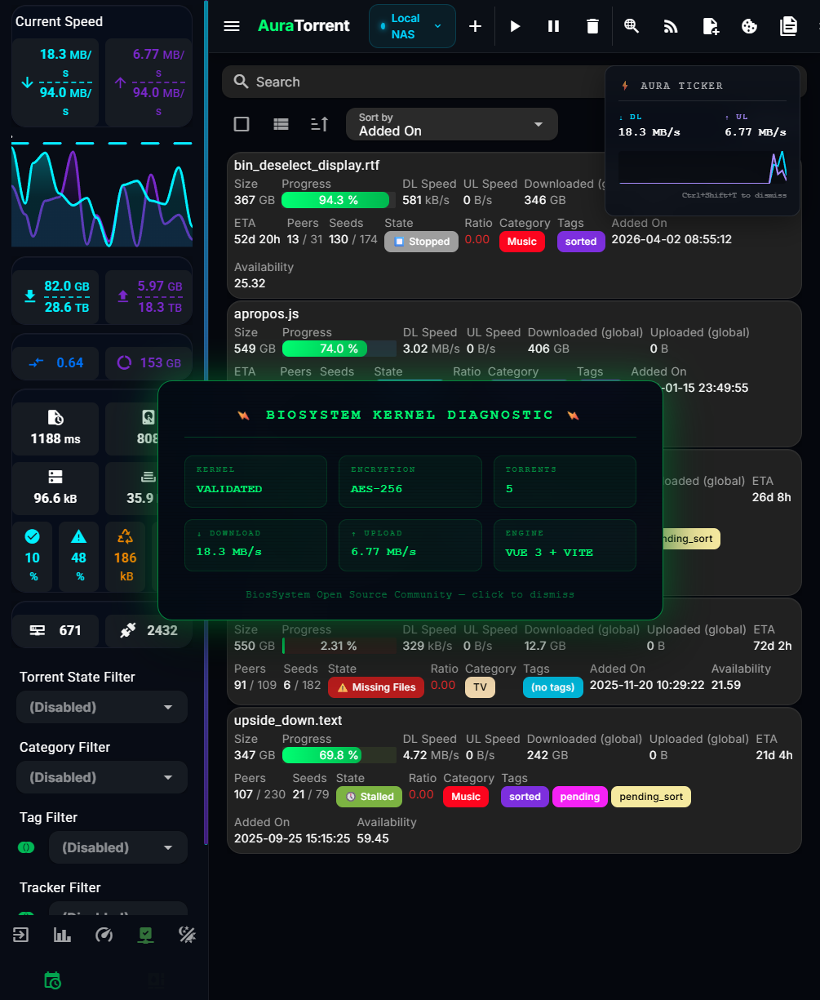
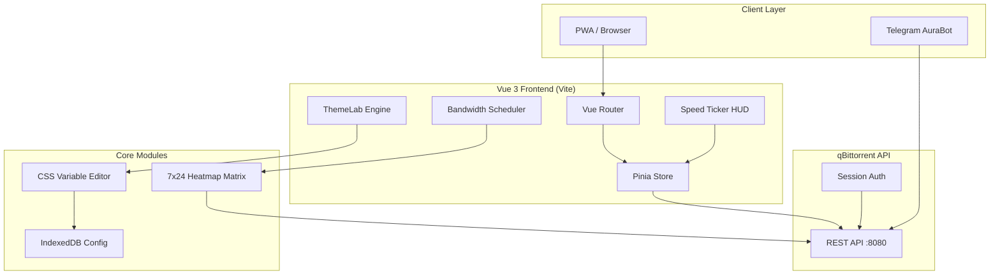

<p align="center">
  
</p>

<p align="center">
  <a href="https://skillicons.dev">
    
  </a>
</p>

<p align="center">
  
  
  
  
</p>

<p align="center">
  <strong>🌐 Part of the <a href="https://bios-system.net">BiosSystem Suite</a></strong>
</p>

**AuraTorrent** is a beautiful, lightning-fast open-source WebUI for qBittorrent. Built on Vue 3 and Vite, it reimagines the seedbox experience with dynamic scheduling, real-time telemetry HUDs, and deep customization.

<p align="center">
  <h3>⚡ WebUI Overview & Torrent Dashboard</h3>
  
</p>

<p align="center">
  <h3>📅 Bandwidth Scheduler Heatmap Matrix</h3>
  
</p>

<p align="center">
  <h3>🎨 ThemeLab CSS Customization Engine</h3>
  
</p>

<p align="center">
  <h3>📈 Speed Ticker HUD (Sparkline Speeds Overlay)</h3>
  
</p>

<p align="center">
  <h3>🖥️ B-I-O-S Kernel Diagnostic Overlay</h3>
  
</p>

## 🏗️ Architecture



## ✨ Why It's Unique

Unlike standard qBittorrent WebUIs, AuraTorrent includes next-gen features designed for power users:

- **Bandwidth Scheduling Matrix** - A 7x24 visual heatmap grid to paint your bandwidth schedule visually. The UI automatically throttles qBittorrent based on the current hour.
- **AuraTheme Engine** - A live, built-in CSS variable editor. Adjust glassmorphism blur, neon glow intensity, and accent colors in real-time, then export to JSON.
- **Global Speed Ticker** - Press `Ctrl+Shift+T` anywhere to summon a floating, always-on-top HUD sparkline graph of your current I/O speeds.
- **B-I-O-S Easter Egg** - Type `B-I-O-S` on your keyboard to unlock the BiosSystem Kernel Diagnostic HUD.

## 📊 Feature Matrix Comparison

| Feature | AuraTorrent | VueTorrent | Flood | Default UI |
|---|:---:|:---:|:---:|:---:|
| **Modern Neon Glassmorphism UI** | ✅ | ❌ | ❌ | ❌ |
| **Mobile Responsive (PWA)** | ✅ | ✅ | ✅ | ❌ |
| **Telegram Companion Bot (AuraBot)** | ✅ | ❌ | ❌ | ❌ |
| **Live Theme Editor Lab** | ✅ | ❌ | ❌ | ❌ |
| **Multi-Daemon Switcher** | ✅ | ❌ | ❌ | ❌ |
| **Visual Bandwidth Heatmap** | ✅ | ❌ | ❌ | ❌ |
| **Global Speed Ticker HUD** | ✅ | ❌ | ❌ | ❌ |

## 🖥️ Platform Support

| Platform | Support | Notes |
|---|:---:|---|
| **Windows / macOS / Linux** | ✅ Native | Works in any modern desktop browser. |
| **iOS / iPadOS** | ✅ PWA | Add to Home Screen for a native app-like experience. |
| **Android** | ✅ PWA | Install via Chrome. Handles `magnet:` links directly. |
| **Docker / Seedboxes** | ✅ Supported | Mount into your container's WebUI folder. |

## 🚀 Quick Start (Production)

**Step 1.** Download the latest release:
```bash
wget https://github.com/BiosSystem/AuraTorrent/releases/latest/download/auratorrent.zip
```

**Step 2.** Extract to your qBittorrent WebUI directory:
```bash
unzip auratorrent.zip -d /path/to/qbittorrent/webui
```

**Step 3.** Enable the custom UI in qBittorrent:

Open `Options → WebUI`, check **Use alternative Web UI**, and point it to the extracted folder.

**Step 4.** Reload your browser and enjoy AuraTorrent.

## 🛠️ Developer Setup

**Step 1.** Clone the repository:
```bash
git clone https://github.com/BiosSystem/AuraTorrent.git
cd AuraTorrent
```

**Step 2.** Install dependencies:
```bash
npm install
```

**Step 3.** Start the development server:
```bash
npm run dev
```

**Step 4.** Open `http://localhost:5173` and connect to your local qBittorrent instance.

## 📖 Documentation

Full documentation is available in the **[Wiki](https://github.com/BiosSystem/AuraTorrent/wiki)**.

## 🙏 Attribution & Credits

AuraTorrent builds upon the open-source PWA foundation of **VueTorrent**. We honor and attribute the core architecture to **WDaan** and the VueTorrent contributor community.

- **Original Repository**: [VueTorrent](https://github.com/VueTorrent/VueTorrent)
- **License**: GPL-3.0

## 🔒 Security

AuraTorrent is built with safety and code integrity in mind:

- **Zero-Vulnerability Baseline** - Regularly audited dependencies to ensure `npm audit` reports 0 vulnerabilities.
- **Strict WebUI Sandboxing** - Enforces restricted API communications and secure CORS configurations.
- **Upstream Parity Security Fixes** - Integrates upstream patches directly from verified VueTorrent pull requests.

For detailed security policies and reporting guidelines, refer to our [Security Policy](SECURITY.md).

*Copyright © 2026 BiosSystem | Powered by BiosSystem Kernel*
